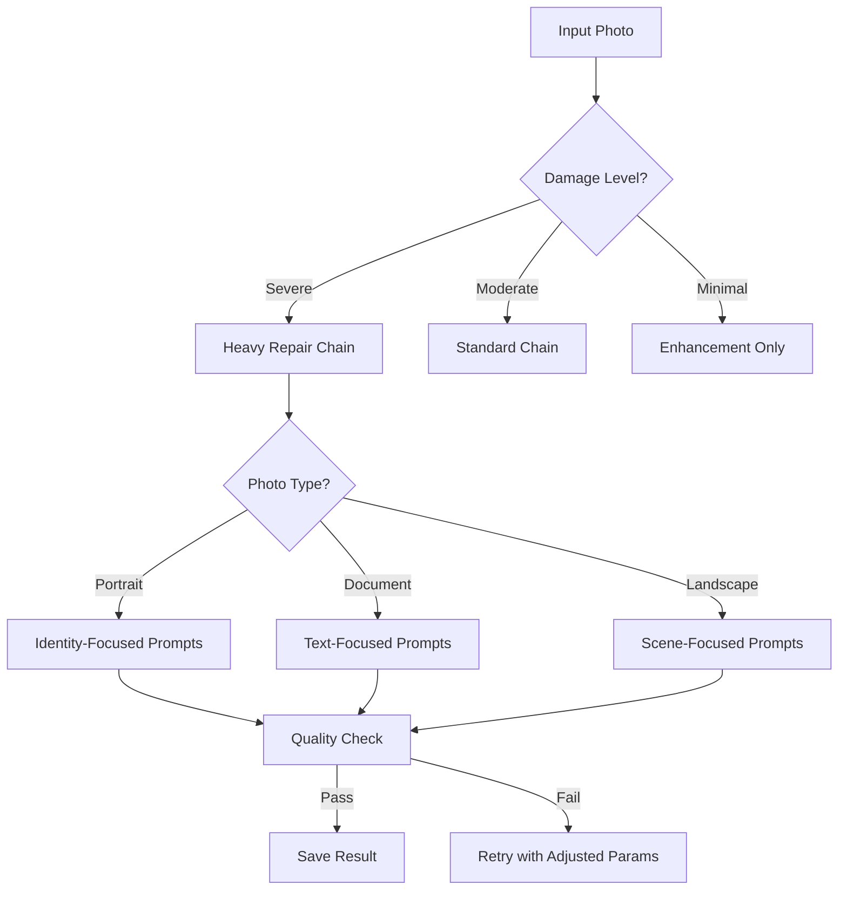

# Testing & Improvement Strategy for AI Restoration Pipeline

> ⚠️ **DEPRECATED DOCUMENT**
> 
> This document contains outdated testing strategies from an earlier implementation.
> 
> **For current testing procedures, please refer to:**
> - Production workflow: `process_workflow_final.py`
> - API testing: [API_REFERENCE.md](API_REFERENCE.md#testing)
> - Integration testing: [AIRTABLE_SETUP.md](AIRTABLE_SETUP.md#testing)
> 
> This document is preserved for historical reference only.

---

## Executive Summary (Legacy)

This document outlined a comprehensive testing and improvement strategy for the Saroop Singh Archive AI restoration pipeline using **Gemini 2.5 Flash** and Airtable integration.

## Phase 1: Baseline Testing (Week 1)

### Objectives
- Establish baseline performance metrics
- Identify optimal prompts for each use case
- Document failure patterns

### Test Matrix

| Photo Type | Test Prompts | Expected Outcomes | Success Metrics |
|------------|--------------|-------------------|-----------------|
| B&W Portraits | Color Restoration, Modern Remake | Natural skin tones, preserved identity | 95% identity match |
| Damaged Group Photos | Damage Repair → Enhancement | Clear faces, restored details | 90% detail recovery |
| Low-res Documents | Resolution Enhancement → Transcription | Readable text, accurate OCR | 98% text accuracy |
| Vintage Landscapes | Creative Reimagining | Artistic but faithful | 85% composition match |

### Execution Plan (Legacy - Do Not Use)
```bash
# DEPRECATED: These scripts no longer exist
# For current testing, use:
# python process_workflow_final.py
# Or via API: POST /api/process
```

### Data Collection
- Execution times per prompt
- Success/failure rates
- Output quality scores (manual review)
- API costs and usage

## Phase 2: Prompt Optimization (Week 2)

### A/B Testing Framework

#### Test Variables
1. **Temperature Settings**
   - Conservative: 0.3-0.5 (consistent results)
   - Balanced: 0.6-0.7 (current default)
   - Creative: 0.8-0.9 (artistic variation)

2. **Prompt Structures**
   - Directive-based: "Create..., Preserve..., Enhance..."
   - Descriptive: "Phase One medium format, golden hour..."
   - Technical: "6000px, sRGB, f/2.8 depth..."

3. **Chaining Strategies**
   - Linear: A → B → C
   - Parallel: A + B + C → Merge
   - Conditional: If quality < threshold, retry with different prompt

### Testing Protocol

```python
# A/B Test Configuration in Airtable
test_configs = [
    {
        "name": "Conservative Restoration",
        "temperature": 0.4,
        "prompts": ["Damage Repair", "Gentle Enhancement"],
        "target_photos": ["portraits", "documents"]
    },
    {
        "name": "Aggressive Enhancement", 
        "temperature": 0.8,
        "prompts": ["Creative Reimagining", "Modern Remake"],
        "target_photos": ["landscapes", "group_photos"]
    }
]
```

### Metrics for Comparison
- **Quantitative**
  - SSIM (Structural Similarity Index)
  - PSNR (Peak Signal-to-Noise Ratio)
  - Execution time
  - API token usage

- **Qualitative**
  - Identity preservation (1-10 scale)
  - Artifact presence (none/minor/major)
  - Color accuracy (natural/enhanced/unrealistic)
  - Detail enhancement (poor/good/excellent)

## Phase 3: Workflow Refinement (Week 3)

### Workflow Patterns

#### Pattern 1: Progressive Enhancement
```
Original → Light Repair → Gradual Color → Subtle Enhancement
- Best for: High-value family portraits
- Temperature: 0.4 → 0.5 → 0.6
- Priority: Identity preservation
```

#### Pattern 2: Dramatic Restoration
```
Original → Heavy Repair → Bold Colorization → Artistic Enhancement
- Best for: Severely damaged photos
- Temperature: 0.6 → 0.7 → 0.8
- Priority: Visual impact
```

#### Pattern 3: Documentary Preservation
```
Original → Minimal Repair → Historical Colorization → Archival Enhancement
- Best for: Historical documents
- Temperature: 0.3 → 0.4 → 0.4
- Priority: Accuracy
```

### Decision Tree Implementation



## Phase 4: Continuous Improvement (Ongoing)

### Weekly Review Process

1. **Monday: Metrics Review**
   - Pull Test Runs data from Airtable
   - Calculate success rates by prompt
   - Identify underperforming combinations

2. **Wednesday: Prompt Tuning**
   - Adjust prompts based on failures
   - Test new prompt variations
   - Update Airtable configurations

3. **Friday: Workflow Updates**
   - Implement successful changes
   - Document learnings
   - Plan next week's tests

### Performance Dashboard

Create Airtable views for monitoring:

```javascript
// Success Rate Formula
IF(
  {Total Runs} > 0,
  ROUND(({Successful Runs} / {Total Runs}) * 100) & "%",
  "No data"
)

// Average Quality Score
IF(
  COUNT({Quality Scores}) > 0,
  ROUND(AVERAGE({Quality Scores}), 1),
  "Not evaluated"
)

// Efficiency Rating
IF(
  AND({Success Rate} > 90, {Avg Execution Time} < 30),
  "⭐⭐⭐⭐⭐",
  IF(
    AND({Success Rate} > 75, {Avg Execution Time} < 60),
    "⭐⭐⭐⭐",
    IF(
      {Success Rate} > 50,
      "⭐⭐⭐",
      "⭐⭐"
    )
  )
)
```

## Quality Evaluation Framework

### Manual Review Protocol

#### Weekly Sampling
- Review 10% of outputs manually
- Focus on edge cases and failures
- Document patterns in feedback

#### Evaluation Criteria

| Aspect | Weight | Scoring Guide |
|--------|--------|---------------|
| Identity Preservation | 40% | Face recognition match percentage |
| Technical Quality | 25% | Resolution, artifacts, noise |
| Color Accuracy | 20% | Natural tones, period-appropriate |
| Composition | 15% | Maintained framing and perspective |

### Automated Quality Checks

```python
def evaluate_restoration(original_path, restored_path):
    """Automated quality evaluation."""
    
    metrics = {
        'face_match': compare_faces(original_path, restored_path),
        'ssim': calculate_ssim(original_path, restored_path),
        'color_histogram': compare_histograms(original_path, restored_path),
        'sharpness': measure_sharpness(restored_path),
        'artifacts': detect_artifacts(restored_path)
    }
    
    # Calculate weighted score
    score = (
        metrics['face_match'] * 0.4 +
        metrics['ssim'] * 0.25 +
        metrics['color_histogram'] * 0.2 +
        metrics['sharpness'] * 0.15
    )
    
    return score, metrics
```

## Optimization Strategies

### 1. **Prompt Caching**
Store successful prompt-photo combinations:
```python
cache_key = f"{photo_type}_{use_case}_{quality_level}"
if cache_key in prompt_cache:
    return prompt_cache[cache_key]
```

### 2. **Dynamic Temperature**
Adjust based on photo characteristics:
```python
def get_optimal_temperature(photo_analysis):
    if photo_analysis['damage_level'] > 0.7:
        return 0.6  # More creative for heavy damage
    elif photo_analysis['is_portrait']:
        return 0.4  # Conservative for faces
    else:
        return 0.5  # Default
```

### 3. **Parallel Processing**
For independent prompts:
```python
from concurrent.futures import ThreadPoolExecutor

with ThreadPoolExecutor(max_workers=3) as executor:
    futures = []
    for prompt in parallel_prompts:
        future = executor.submit(process_prompt, photo, prompt)
        futures.append(future)
    
    results = [f.result() for f in futures]
```

## Cost Optimization

### Token Usage Tracking

| Prompt Type | Avg Tokens | Cost per Image | Monthly Budget |
|-------------|------------|----------------|----------------|
| Simple Restoration | 500 | $0.02 | $20 |
| Complex Chain | 2000 | $0.08 | $80 |
| Full Workflow | 5000 | $0.20 | $200 |

### Optimization Tactics
1. **Prompt Compression**: Remove redundant instructions
2. **Early Stopping**: Halt chains if quality threshold met
3. **Batch Processing**: Group similar photos
4. **Result Caching**: Reuse successful outputs

## Risk Mitigation

### Common Failure Modes

| Issue | Detection | Mitigation |
|-------|-----------|------------|
| Identity Loss | Face match < 80% | Reduce temperature, add identity constraints |
| Color Artifacts | Histogram anomalies | Switch to conservative prompt |
| Over-smoothing | Detail loss > 30% | Add texture preservation directives |
| API Timeout | Response > 60s | Implement retry with backoff |

### Fallback Strategy
```python
def process_with_fallback(photo, primary_prompt, fallback_prompt):
    try:
        result = process_prompt(photo, primary_prompt)
        if evaluate_quality(result) < QUALITY_THRESHOLD:
            result = process_prompt(photo, fallback_prompt)
    except Exception as e:
        result = process_prompt(photo, fallback_prompt)
    return result
```

## Success Metrics

### KPIs for Month 1
- ✅ 90% success rate for standalone prompts
- ✅ 75% success rate for sequential chains
- ✅ < 30 second average execution time
- ✅ < $0.10 average cost per photo
- ✅ 95% identity preservation for portraits

### Long-term Goals (3 months)
- 95% overall success rate
- Fully automated quality evaluation
- Self-optimizing prompt selection
- Cost reduction of 50%
- Processing 1000+ photos monthly

## Implementation Timeline

### Week 1: Foundation
- [ ] Set up Airtable tracking
- [ ] Run baseline tests
- [ ] Document initial results

### Week 2: Optimization
- [ ] A/B test prompt variations
- [ ] Tune model parameters
- [ ] Implement quality checks

### Week 3: Scaling
- [ ] Build workflow patterns
- [ ] Add parallel processing
- [ ] Optimize for cost

### Week 4: Production
- [ ] Deploy automated pipeline
- [ ] Set up monitoring
- [ ] Train on edge cases

## Reporting Template

### Weekly Report Structure
```markdown
# Restoration Pipeline Report - Week X

## Summary
- Photos Processed: X
- Success Rate: X%
- Average Quality: X/10
- Total Cost: $X

## Key Findings
- Best performing prompt: [Name]
- Most challenging photo type: [Type]
- Optimization implemented: [Description]

## Next Steps
- [ ] Action item 1
- [ ] Action item 2

## Metrics Dashboard
[Link to Airtable view]
```

## Conclusion

This testing strategy provides a systematic approach to optimizing the AI restoration pipeline. By following these phases and continuously monitoring performance, we can achieve high-quality, cost-effective photo restoration at scale.

---

*Document Version: 1.0*
*Last Updated: December 2024*
*Next Review: January 2025*